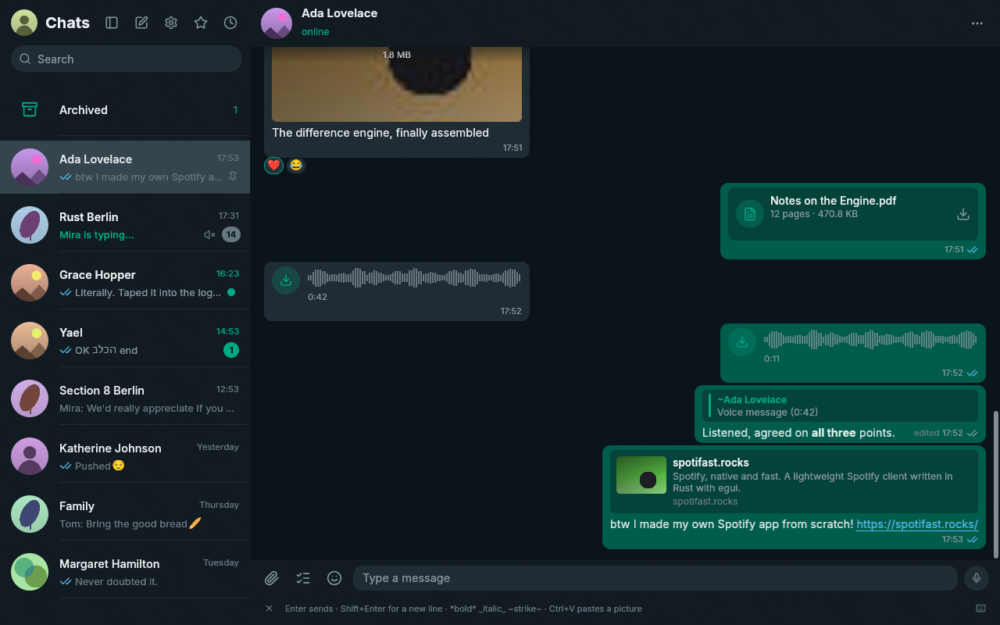
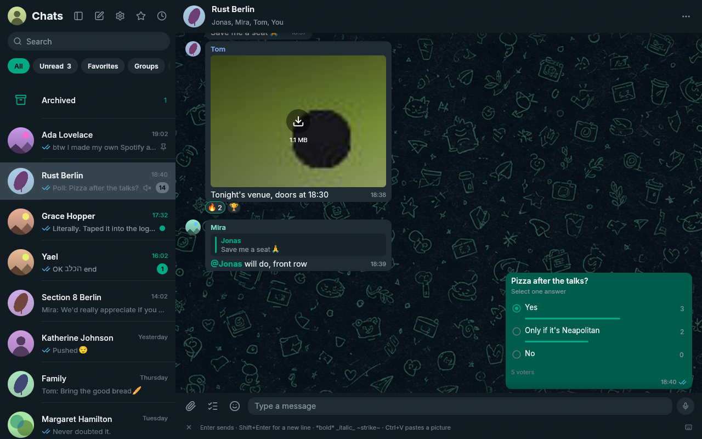
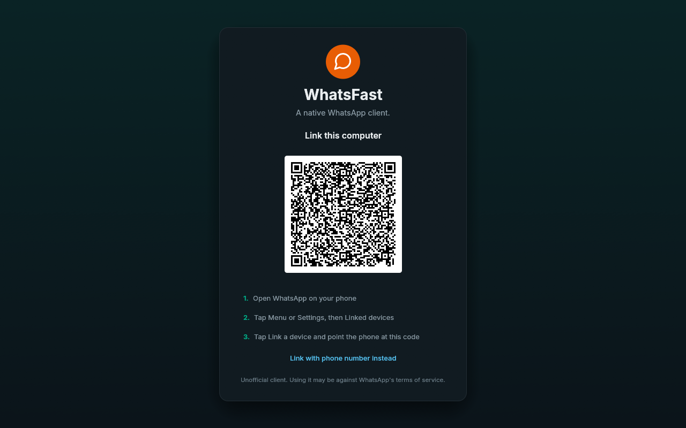

<div align="center">


# WhatsFast

**The most powerful, robust, fast, and complete native WhatsApp linked-device client for Windows.**

Rust + [egui](https://github.com/emilk/egui). Protocol: [whatsapp-rust](https://github.com/oxidezap/whatsapp-rust). **No browser engine.**

<table>
<tr>
<td align="center" width="33%"><strong>Native</strong><br />No Chromium. No browser engine.</td>
<td align="center" width="33%"><strong>Windows 10 and 11</strong><br />Installer on GitHub Releases.</td>
<td align="center" width="33%"><strong>Encrypted archive</strong><br />SQLCipher plus Credential Manager.</td>
</tr>
</table>

<br />

[](https://github.com/LisandroNahuelH/whatsfast/releases)
[](https://github.com/LisandroNahuelH/whatsfast/releases)
[](https://www.rust-lang.org/)
[](LICENSE)
[](#install-windows)

<br />

<a href="https://github.com/LisandroNahuelH/whatsfast/releases">
  
</a>

<br />








<sub>Screenshots from the offline demo. No real chats.</sub>

</div>

<p align="center">
  <a href="#what-it-does">What it does</a> ·
  <a href="#whatsfast-extras">Extras</a> ·
  <a href="#install-windows">Install</a> ·
  <a href="#upgrading-from-zapfast">Upgrade</a> ·
  <a href="#using-it">Using it</a> ·
  <a href="#files">Files</a> ·
  <a href="#developing">Developing</a> ·
  <a href="#disclaimer">Disclaimer</a> ·
  <a href="#license">License</a> ·
  <a href="#attributions">Credits</a>
</p>

---

WhatsFast is **Windows 10 and 11 desktop only** for downloads and support.

It is a Windows-focused fork of [ZapFast](https://github.com/crmne/zapfast) by [Carmine Paolino](https://github.com/crmne). **Maintainer:** [LisandroNahuelH](https://github.com/LisandroNahuelH) only. This repository is not the upstream ZapFast project. See [ATTRIBUTIONS.md](ATTRIBUTIONS.md) for credits.

WhatsApp, native and fast: a linked-device client with no browser engine. Scan a QR code (or link with your phone number). Recent history is copied to this computer and stored here.

On Linux, upstream ZapFast measured about 150 MB of idle RAM against 1.13 GB for WhatsApp Web and its Chromium processes. [See those measurements](https://zapfast.rocks/benchmarks/). WhatsFast does not yet publish a Windows measurement of its own.

## What it does

- **Links to your phone.** Scan a QR code or link with your phone number. Recent history is copied to this computer after linking and stored here.
- **Chats.** See pinned, unread, muted, and archived chats, typing indicators, and message status. Search chats, saved messages, and contacts. Chat and contact name searches ignore accents, so `Angel` finds `Ángel`. The open-chat Search icon and **Ctrl+G** search this thread in a right pane; **Ctrl+F** still searches the chat list. Pinned chats stay in pin order (most recently pinned first), regardless of new messages. Typing indicators show other participants, excluding your own linked devices. Filter chips under the search bar are a WhatsFast extra: **All**, **Unread**, **Favorites**, **Groups**, and your own lists. See [WhatsFast extras](#whatsfast-extras).
- **Read state across devices.** Reading a chat syncs its unread badge with your phone and other linked devices, including when read receipts are off. Replies from another device clear preceding unread messages. The read-receipt toggle also controls voice-message played receipts; account privacy is checked before sending receipts in direct chats. A hidden window does not read messages.
- **Conversations.** See replies, reactions, edits, deleted messages, read receipts, sender names, and group pictures. Older messages load as you scroll up, first from the local archive and then from your phone. Group messages show two gray checks after every recipient has received them, and blue checks after every recipient has read them. The recipient list and individual receipts are saved locally; later membership changes do not change that list. If the original recipients are unknown, WhatsFast waits for the phone's aggregate status instead of guessing from one reader.
- **WhatsApp formatting.** Bold, italic, strikethrough, code, lists, quotes, mentions, and link previews are supported. Links are clickable. Hebrew and Arabic RTL paragraphs keep logical word order by reordering font runs; this is not a full Unicode Bidirectional Algorithm. Emoji use the desktop's color emoji font, with a bundled fallback, and emoji-only messages are larger.
- **Interface type.** Every window label uses bundled [Montserrat](https://github.com/JulietaUla/Montserrat) Variable (`wght` 100–900): titles, lists, composer, and code spans. Scripts Montserrat does not cover fall back to a system sans.
- **Send attachments with captions.** Paste a picture, drop files, or use the file picker. They stay in the composer until you send them or press Escape.
- **Mute chats** for eight hours, one week, or indefinitely. The setting also applies on your phone and to desktop notifications. Mute changes from your phone survive history arriving later, including during initial linking. Existing installations request one settings refresh after upgrading to recover previously lost mute settings and pin order, without relinking.
- **Voice messages.** Play, seek, record, reply with, and send voice messages in the chat. Play and the waveform share one centred row. Duration starts at the left of the waveform, on the same line as the clock. The playback speed cycles between 1x, 1.5x, and 2x from the bubble, keeping the speaker's pitch, and the last choice applies to later messages. The app normalizes quiet recordings and handles OGG/Opus without external tools.
- **Send messages.** Press Enter to send text and Shift+Enter for a new line. You can swap these keys in Settings. The composer is focused when you open or return to a conversation; invoking search keeps focus in search, and Escape clears search and returns to the composer; another Escape closes the chat and saves your text draft. Open menus, dialogs, and unfinished actions are dismissed first. Type `:name` to autocomplete an emoji without leaving the composer, or `@` in a group to mention a member. Reply, react with any emoji, edit, forward, delete, and check when a message was sent, delivered, or read.
- **Disappearing-message timers.** Outgoing messages use the chat's known timer, including replies, attachments, edits, and forwards. Forwarded copies use the destination chat's timer. Received messages remain in the local archive after they expire on the phone. A clock badge on chat avatars shows enabled timers and follows changes from the phone. Changing the default timer for new chats leaves existing chats alone.
- **View attachments.** WhatsFast downloads files up to 64 MB automatically or on click. Photos, stickers, GIFs, voice messages, audio, locations, contacts, polls, and link previews appear in the chat. Clicking a photo or video opens an in-app viewer with zoom, pan, and a gallery (see [WhatsFast extras](#whatsfast-extras)). A click on a sticker or GIF uses the same bubble actions as text (reply, menu, select). Documents open in their default desktop apps. If an attachment has expired, WhatsFast asks your phone to upload it again.
- **Polls.** Use the checklist button beside the paperclip to create a poll with 2 to 12 answers. Turn off **Allow multiple answers** for a single-choice poll. Click an answer in a poll to vote; click a selected answer again to remove it. Results and your selection are retained in the encrypted archive, including votes received through phone history. Visible polls automatically request earlier votes from your phone. If it is offline, results are labelled incomplete and the request retries with backoff; no refresh button or relinking is needed. Voting needs the original poll's key; if that key is missing, the message explains that voting is available on your phone. Creating polls in disappearing-message chats is not yet supported by the protocol library's poll API, so WhatsFast blocks it instead of ignoring the timer.
- **Emoji, GIF, and sticker picker.** Search emoji and GIFs, use recent emoji and stickers, and save stickers with a right-click. Emoji autocomplete and picker search select their first match; use the arrow keys and Enter to choose it. GIF search needs a free GIPHY API key unless the build includes one.
- **Sticker packs.** Import a pack from a `signal.art` link or `.wastickers` file. Animated packs remain animated. Packs are stored as WebP files on your computer.
- **Consistent names.** Use names from your address book or public WhatsApp profile names across chats, replies, mentions, and notifications.
- **Groups.** See members, sender names, and sender pictures. Announcement groups are read-only for non-admins. Leave a group from the chat list, the chat menu, or the group card. Confirm to leave, or leave and archive the chat. Local history stays.
- **Channels.** Leave a channel from the chat list, the chat menu, or the channel card. Confirm to leave, or leave and archive. Local history stays.
- **Presence.** See online, last-seen, and typing status, and send your typing status. Settings **Privacy** writes last seen, online, photo, About, groups, account receipts, calls, and who can message on the WhatsApp account.
- **Idle rendering.** History-sync progress updates when data arrives. Animated stickers and GIFs play only while their message or picker tile is visible.
- **Sync recovery.** A conflicting app-state collection is recovered through whatsapp-rust, including requesting a fresh snapshot from the paired phone when validation fails. Private read-state updates run one at a time. Failures pause the whole queue with backoff from 30 seconds to 15 minutes; pending reads remain saved and resume automatically. New messages can still arrive.
- **Runs in the background.** Closing the window keeps WhatsFast linked in the system tray. Reopen it from the tray or by launching it again. Quit from the tray or with `Ctrl+Q`, or disable this behavior in Settings.
- **Desktop notifications.** Get notifications with the chat picture when you are away from the open chat. Muted chats do not notify you. Windows notifications identify WhatsFast as the sender and show chat pictures as small circular icons; installed and portable builds register this identity in the current user's registry.
- **Update notices.** With check and download enabled (both on by default), a sticky toast offers a one-click **Update**. That installs the GitHub release, restarts WhatsFast, and reopens the last chat. If you skip the toast, the next start applies the verified download. Closing to the tray does not install. See [WhatsFast extras](#whatsfast-extras).
- **Themes.** Light, dark, follow the system, or a local JSON palette. Zoom with Ctrl+plus and Ctrl+minus.
- **Copy text.** Select part of a message or copy across messages in WhatsApp's `[time, date] Name:` format. Contact names and numbers are also selectable.
- **Keyboard shortcuts.** `Ctrl+K` searches, `Alt+↑/↓` switches chats and keeps the active chat visible in the list, `Esc` cancels the current action, `Ctrl+L` focuses the message input, and `Ctrl+/` lists all shortcuts. The × at the left of the shortcut hints hides the bar; restore it with **Show shortcut hints** in Settings.
- **Local storage.** Messages, contacts and sticker metadata are stored in a SQLCipher-encrypted archive, unlocked automatically through Windows Credential Manager. Existing plaintext archives are migrated on first use. Attachments remain ordinary files in the cache directory. Unlinking deletes both and removes this device from your phone.

## What it does not do yet

- Reply to a message with an attachment.
- Calls, status posts, communities, newsletters, and group administration.

## WhatsFast extras

Each item below is a WhatsFast change on top of the upstream ZapFast baseline. Under every title: what it does in the app, then why it helps day to day.

<table>
<tr>
<td colspan="2" valign="top">

### Chat list filters: All, Unread, Favorites, Groups, and your own lists

- **Technical:** Chips under the search box filter the left chat list. **All** is the default and keeps today's WhatsApp pins. **Unread** shows counted unread plus the empty local mark. **Favorites** is a local flag from the chat menu or the contact card. **Groups** shows group chats. **+** names a list and picks members with the same searchable chat picker as Forward. Each chip, including Unread and Favorites, has its own pin order. Custom lists stay in the archive. They do not create WhatsApp groups or labels.
- **Daily use:** Open Unread to work the inbox, keep a Favorites strip for people you always need, and make a Work list without mixing those pins into All.

</td>
</tr>
<tr>
<td width="50%" valign="top">

### Chat doodle wallpaper that follows the theme

- **Technical:** The open chat paints a 1080p doodle wallpaper behind the bubbles and scales it to fill the panel as the window resizes. Settings **Chat wallpaper** is Auto by default (Black 1 to White 3 from the theme colours). Hover a name to preview it. Right-click the open chat and choose **Next wallpaper** to step through the three doodles for that family. Settings itself stays a plain colour.
- **Daily use:** The thread looks like WhatsApp's doodle paper, tinted to Dark, Nord, Ristretto, or Light, without hiding the bubbles.

</td>
<td width="50%" valign="top">

### Mark as unread from the chat list

- **Technical:** Right-click a chat in the left list (or the compact rail) and choose **Mark as unread**. The row uses the unread style with an empty round badge and no number. Opening the chat, **Mark as read**, or a real new message clears it. Counted unread badges stay numbered.
- **Daily use:** Flag a thread you still need to answer without pretending there is a pending count. Same empty dot as WhatsApp Desktop.

</td>
</tr>
<tr>
<td colspan="2" valign="top">

### Leave a group, or leave and archive

- **Technical:** **Leave group** is on the chat-list menu, the open-chat **More** menu, and the group card. A confirm dialog offers **Leave group** or **Leave group and archive**. The phone is told through `groups().leave`. The chat stays in the archive as read-only. The composer says **You left this group**.
- **Daily use:** Leave a group from the list or the group photo without hunting Settings. Archive in the same step if you do not want the leftover chat in the inbox.

</td>
</tr>
<tr>
<td colspan="2" valign="top">

### Leave a channel, or leave and archive

- **Technical:** **Leave channel** is on the chat-list menu, the open-chat **More** menu, and the channel card. A confirm dialog offers **Leave channel** or **Leave channel and archive**. The phone is told through `newsletter().leave`. The chat stays in the archive as read-only. The composer says **You left this channel**. Broadcast lists are not channels.
- **Daily use:** Unfollow a channel from the list or the channel photo. Archive in the same step if you do not want the leftover chat in the inbox.

</td>
</tr>
<tr>
<td colspan="2" valign="top">

### Search messages in the open chat

- **Technical:** The open chat shows a **Search** icon to the left of **More**. It opens a right inspector (**Ctrl+G**) that searches this chat, with an optional day filter. The calendar opens under the date icon, centered on it, and a click elsewhere closes it. A click on a hit scrolls to the message and pulses the whole row three times. **Ctrl+F** / **Ctrl+K** still search the chat list.
- **Daily use:** You can find a message in the thread you already have open, without leaving that chat or mixing it with results from every other conversation.

</td>
</tr>
<tr>
<td colspan="2" valign="top">

### Account privacy from Settings

- **Technical:** Settings **Privacy** reads last seen, online, profile photo, About, who can add you to groups, account read receipts, who can call you, and who can message you from the linked WhatsApp account, then writes the same values the phone uses. **Except…** picks 1:1 chats to hide that item from. **Send read receipts** and **Show when you are typing** sit in the same section and still apply only to this copy.
- **Daily use:** Hide last seen or your photo on the account, not only in this window. The phone shows the same setting.

</td>
</tr>
<tr>
<td width="50%" valign="top">

### One-click in-app updates

- **Technical:** With check and download enabled (both on by default), a sticky toast says a new version is available. One click on **Update** installs the GitHub release now, restarts WhatsFast, and reopens the last chat. If you skip the toast, Quit or the next launch installs the verified file. Closing to the tray is not a restart. Installer and portable builds only; package-manager installs keep their own update path.
- **Daily use:** Click Update now, or keep working. The next time WhatsFast starts, it installs the file it already verified.

</td>
<td width="50%" valign="top">

### In-app media viewer with gallery and actions

- **Technical:** Clicking a photo or video in a chat opens a full-window viewer. The header shows the chat and actions (zoom, go to the message, reply, star, pin, react, forward, download, close). A filmstrip along the bottom lists every image and video in that chat from the archive, oldest first. Arrow keys and chevrons step through that list, including items still downloading. Stickers and GIFs keep the click on the message row. **Open file** in the bubble menu still uses the system handler.
- **Daily use:** You can walk a whole album without leaving WhatsFast, zoom a screenshot, reply or pin from the photo, and jump back to the message in the thread.

</td>
</tr>
<tr>
<td width="50%" valign="top">

### Composer caret stays visible while the window has focus

- **Technical:** The message composer keeps a visible text caret (insertion point) whenever the WhatsApp window has keyboard focus, including after repaints and layout updates in egui. The empty field is 35% taller than one line, the caret fills that height, attach/emoji/send/schedule sit on the row's vertical center, and the bubble sits 20% farther from the window's bottom edge than before.
- **Daily use:** You always see where the next character will land. Long replies, edits, and paste-at-cursor work feel like a normal desktop editor, not a web view that hides the caret.

</td>
<td width="50%" valign="top">

### Hide the create-poll control in Settings

- **Technical:** Settings exposes a toggle that removes the create-poll entry from the attachment menu next to the composer. The rest of poll viewing and voting is unchanged.
- **Daily use:** If you never create polls, the menu stays shorter and you stop mis-tapping poll when you wanted a file or photo. Cleaner composer for work chats that rarely use polls.

</td>
</tr>
<tr>
<td width="50%" valign="top">

### Background download of older chat history

- **Technical:** Settings **Downloads** → **Download older history in the background** (Recent and pinned by default) slowly asks the phone for older messages and then downloads their files up to 64 MB. Failed files are asked again with a long wait, for up to 30 days. It fills the local archive, not the visible thread. Off turns it off. **Current Chat** covers only the open conversation. Recent and pinned covers every pinned chat plus the ten most recently active chats that are not pinned. Hover a name in the list to read what it does. It keeps running from the tray.
- **Daily use:** Scroll up later and the older text, photos, videos, and documents are already there, without hitting WhatsApp's rate limit from a fast flick.

</td>
<td width="50%" valign="top">

### Sequential forwarding for batched messages

- **Technical:** When you forward several messages at once, Settings **Forward messages in order** (on by default) sends them one after another. Each one waits until the message before it shows its first tick, so mixed text, pictures, and videos keep the original chat order. When off, they send together and may arrive out of order.
- **Daily use:** Instructions, numbered steps, and screenshots stay in the order you selected. Better for handoffs, checklists, and “read top to bottom” threads at work.

</td>
</tr>
<tr>
<td width="50%" valign="top">

### Downloads usage in Settings

- **Technical:** Settings **Downloads** groups automatic attachment download and older-history prefetch. It shows total archive weight, how many messages are stored, and 6 px bars for images, videos, and stickers plus GIFs (voice and documents appear as Other when they have weight). **Open folder** opens `cache/media`. The numbers come from one archive SQL aggregate of persisted `media.size` values with a local path, not from walking the disk on the interface thread.
- **Daily use:** See how much chat media sits on this PC, then open the folder when you want the files.

</td>
<td width="50%" valign="top">

### Close Settings by clicking the active section again

- **Technical:** The settings panel treats a second click on the already selected section as “close panel,” without adding a separate dismiss control.
- **Daily use:** One click to open a section, one click on the same row to get back to the chat. Fewer stray clicks when you only wanted to tweak one option.

</td>
</tr>
<tr>
<td width="50%" valign="top">

### Starred messages with sidebar list and bubble previews

- **Technical:** Right-click a message and choose **Star** (or **Unstar**) in the bubble menu. Stars are stored in the archive and shown in a dedicated sidebar list with bubble-style previews (same rendering path as the main transcript). Multi-select and the media viewer use the same command.
- **Daily use:** Bookmark decisions, links, and client notes and find them later without scrolling the whole history. The preview shows context so you know which star is which.

</td>
<td width="50%" valign="top">

### Pinned messages in the chat and the sidebar

- **Technical:** Pin a message for everyone in the chat (WhatsApp `PIN_FOR_ALL`, 7 days, at most three active pins per chat). The pin is sent to the phone, stored in the archive, listed like Starred on the left, shown as chips under the chat header, and marked on the bubble with the same pin icon the star uses. Unpin from the bubble menu or the media viewer.
- **Daily use:** Keep a deadline, address, or decision at the top of a busy group without starring it into a private list only you can see.

</td>
</tr>
<tr>
<td width="50%" valign="top">

### Scheduled sends (once or on a repeat rule)

- **Technical:** The composer clock control schedules outbound messages for a future time, once or on a repeat rule defined in the app; the backend queues them and sends when due.
- **Daily use:** Remind a team Monday morning, ping a contact in their timezone, or send a follow-up without staying online. Handy for support windows and async work.

</td>
<td width="50%" valign="top">

### Narrow sidebar rail for navigation

- **Technical:** A slim rail stays visible at the edge of the UI so chat list, starred, scheduled, and related navigation remain one click away in every view.
- **Daily use:** You do not lose your place when switching tasks. Jump between inbox, stars, and scheduled sends without hunting for hidden menus.

</td>
</tr>
<tr>
<td width="50%" valign="top">

### Reorder pinned chats by drag and hold

- **Technical:** Pinned chats in the list support click-and-drag reorder; order is persisted so the archive reflects your chosen pin stack.
- **Daily use:** Put your boss, active project, and family groups where you want them every day. Less scrolling past pins you rarely open.

</td>
<td width="50%" valign="top">

### Multi-select messages for forward, download, and star

- **Technical:** Bubble menu and row actions enter a selection mode across multiple messages; batch forward, save attachments, or star applies to the whole selection with one confirmation path.
- **Daily use:** Forward a week of updates, save every PDF from a thread, or star a run of messages in one go. Less repetitive right-click work in heavy group chats.

</td>
</tr>
</table>

## Install (Windows)

Download the latest `whatsfast-v*-*-pc-windows-msvc-setup.exe` from
[GitHub Releases](https://github.com/LisandroNahuelH/whatsfast/releases).
That is the only published package. The installer then updates itself from GitHub: a toast, one click on **Update**, or the next start if you skip the toast.

<p align="center">
  <a href="https://github.com/LisandroNahuelH/whatsfast/releases">
    
  </a>
</p>

## Upgrading from ZapFast

If you used ZapFast on this PC, link again after installing WhatsFast. Your
linked device entry may still show the old name until you unlink and pair.
WhatsFast reads the same archive path after the one-time folder rename from
`zapfast` to `whatsfast` under your app data directory. The Windows credential
manager key from ZapFast is picked up automatically on first launch.

## Using it

On first start, scan the QR code from WhatsApp under **Linked devices**, **Link a device**. To link without the camera, click **Link with phone number instead**, enter your number with its country code, then enter the shown code on your phone.

WhatsApp then sends your recent history. This can take a few minutes. A banner shows the progress. New messages arrive live, and your phone does not need to stay on the same network.

Right-click a chat or message to open its menu. Double-click a message bubble or its row to reply (the row flashes once). Open Settings from the gear or with `Ctrl+,`. Use the pencil to message a new number or save a contact. You can also open a group member's contact card. Saved names sync through WhatsApp to your phone and linked devices.

## Files

| What | Windows | Notes |
| --- | --- | --- |
| Settings | `%APPDATA%\paolino\whatsfast\config\settings.json` | JSON, safe to edit |
| Device keys | `%LOCALAPPDATA%\paolino\whatsfast\data\session.db` | Owned by whatsapp-rust; deleting it unlinks |
| Messages | `%LOCALAPPDATA%\paolino\whatsfast\data\archive.db` | SQLCipher-encrypted SQLite, unlocked by Credential Manager |
| Attachments, avatars | `%LOCALAPPDATA%\paolino\whatsfast\cache` | Safe to delete |
| Saved stickers and packs | `%LOCALAPPDATA%\paolino\whatsfast\data\stickers\` | Plain WebP files; each pack is a folder |
| Log of the last run | `%LOCALAPPDATA%\paolino\whatsfast\data\whatsfast.log` | `--verbose` for more |

On first start, WhatsFast moves settings, the linked session, message archive, saved stickers, caches, and window state from `zapfast`, `fastsapp`, or the earlier `fastwhatsapp` paths. Existing WhatsFast directories take precedence and are never overwritten. Quit ZapFast before starting WhatsFast; if an older copy is still running, the new launch brings its window forward. Your phone may keep showing the old linked-device name until you link again.

Windows uses the permissions inherited from your user profile.

### Archive encryption

The archive key is a random 256-bit secret in Windows Credential Manager. If the keyring is locked or unavailable, unlock it and click Retry; WhatsFast keeps its archive intact and waits before connecting. It never saves a replacement plaintext archive. Back up both the archive and its Credential Manager key: copying only `archive.db` to another computer is insufficient.

Only `archive.db` and its SQLite journal/WAL are encrypted. Device credentials in `session.db`, downloaded media, profile pictures, saved sticker files and settings remain ordinary files. Use full-disk encryption for those files, swap, backups and remnants of the old plaintext archive. Migration removes the original only after verifying its encrypted copy; deletion cannot guarantee erasure from SSDs or snapshots. Keyring unlocking also does not protect against software running as you while your login is unlocked.

### Interface language

**Settings → Language** offers Follow system, English, and Español. Follow system reads the operating-system language once at startup; a machine set to Spanish opens in Spanish. The choice is saved in `settings.json` and applies to the window at once; the tray item and the macOS menus take the chosen language when the app next starts. Interface text is translated, including dates, the chat list, dialogs, and update notices; message bodies and contact names are never translated.

### Local themes

**Settings → Appearance → Theme** uses Follow system, Light, Dark, and bundled palettes (Catppuccin, Catppuccin Latte, Nord, Ristretto, Tokyo Night, Rose Pine, Rose Pine Moon, and Rose Pine Dawn). Choose **Open themes folder** below the picker to add JSON palettes beside `settings.json`. A local file with a bundled palette's name overrides it. For example:

```json
{"base":"dark","colors":{"accent":"#89b4fa","bubble_out":"#293954"}}
```

Unspecified colors inherit the light or dark base. Spotifast palettes also work: chat backgrounds, bubbles, and links derive from their interface colors when not specified. Color names match `Palette` in `src/theme.rs`; use `#RRGGBB` or `#RRGGBBAA`. The last accepted palette is cached in settings, so a missing or damaged theme file does not reset your appearance.

After you edit a palette, run `whatsfast reload-themes`. The command also works while the window is closed and never launches a stopped app.

### Updating WhatsFast

WhatsFast checks GitHub once a day when **Check for updates** is enabled in Settings **About**. **Download updates automatically** is on by default. A sticky toast says a new version is available. Click **Update** to install the verified GitHub release now, restart, and reopen the last chat. If you skip the toast, the next start of WhatsFast (Quit, Ctrl+Q, or a later launch) installs the verified file. Closing the window to the tray does not install. Downloads contact GitHub's API and release-asset hosts and are checked against the release's SHA-256 checksums. The updater keeps a backup and restores it if the updated app cannot start.

The in-app updater supports marked portable downloads and the Windows installer. Keep `whatsfast-portable.txt` beside a portable executable. A package-manager install, if you built one yourself, keeps that manager's update path. No account or additional service is needed.

## Developing

```sh
cargo run --features demo -- --demo            # sample chats, no connection
cargo run --features demo -- --demo-page login # or settings, pair, info, light, …
cargo run --features demo -- --demo-shot shot.png --demo-page chat,light
cargo run --features demo -- --demo-tour      # Space starts/replays a 41-second tour
cargo test --all-features                      # includes a headless layout of every screen
cargo clippy --all-targets --all-features -- -D warnings
```

To include a default GIPHY key for GIF search, set it at build time. A key in Settings overrides it:

```sh
ZAPFAST_GIPHY_KEY=your-key cargo build --release
```

The earlier `FASTSAPP_GIPHY_KEY` build variable remains supported as a fallback.

`AGENTS.md` describes the architecture and the rules for changes. Run fmt, clippy, and tests locally before you push.

### Recording a demo

The `demo` feature uses offline sample chats in a fresh temporary directory. It does not open your linked account, read your message archive, connect to WhatsApp, or register a tray icon. You can run it alongside your regular app.

```sh
cargo build --locked --features demo
.\target\debug\whatsfast.exe --demo-tour --demo-size 1280x800
```

The **WhatsFast Demo** window waits for **Space**. The 41-second tour starts with search, switches chats with keyboard shortcuts, scrolls, right-clicks a message and selects Reply, types quickly, completes emoji and mentions, searches the GIF picker and sends a still sticker, opens group information and the shortcut list, and changes themes through Settings. It uses the normal mouse and keyboard handlers; a local responder handles outgoing messages with no WhatsApp connection. The GIF-search thumbnails and still stickers are rendered from the bundled Noto emoji font; demo GIF search uses these local fixtures. The tour makes no sound and holds its final frame. Space rebuilds the sample and replays. For an automatic start, add `--demo-tour-delay 5000` (milliseconds). Use `--demo` instead of `--demo-tour` to explore the sample chats yourself.

To annotate a recording with a visible pointer, click rings, and outlined shortcut labels, add `--demo-tour-events tour.json` when launching the tour. After recording, run:

```sh
python scripts/render-demo.py recording.mp4 tour.json launch.mp4 --start 0.8
```

Set `--start` to the recording time (in seconds) when you pressed Space. The export trims the setup footage, adds a caption band below the app, and produces a silent H.264 MP4. It requires `ffmpeg` with libass support and `ffprobe`. These annotations are added during video export, not drawn by the app. The trace contains only pointer coordinates and shortcut labels, not typed text.

### Packaging (Windows)

Release packaging is the Inno Setup script [packaging/windows/whatsfast.iss](packaging/windows/whatsfast.iss). GitHub Releases attach **only** `whatsfast-v*-*-pc-windows-msvc-setup.exe`. See `AGENTS.md` (Releasing) for the local build, tag, and upload runbook.

## Disclaimer

WhatsFast is an unofficial client and is not affiliated with WhatsApp or Meta. Using an unofficial client may be against WhatsApp's terms of service and could get an account suspended. Use it at your own risk.

## License

WhatsFast is distributed under the **[MIT License](LICENSE)**.

The `LICENSE` file names **Lisandro Nahuel** as copyright holder for this repository. Portions derive from ZapFast (see [ATTRIBUTIONS.md](ATTRIBUTIONS.md)). You may use, modify, and redistribute the software under the conditions in that file. The software is provided **as is**, without warranty.

Montserrat and Noto Color Emoji are under the SIL Open Font License; the icons are from [Lucide](https://lucide.dev) (ISC).

For a full list of credits and third-party components, see [Attributions](#attributions) below and [ATTRIBUTIONS.md](ATTRIBUTIONS.md).

## Attributions

WhatsFast stands on work by many open-source authors. **Thank you** to:

- **[Carmine Paolino](https://github.com/crmne)** and contributors of **[ZapFast](https://github.com/crmne/zapfast)**: foundation of this client (MIT).
- **[oxidezap/whatsapp-rust](https://github.com/oxidezap/whatsapp-rust)**: WhatsApp linked-device protocol.
- **[egui](https://github.com/emilk/egui)**: native UI toolkit.
- **Lucide** icon authors ([license](assets/icons/LICENSE.txt)) and **Montserrat** font authors ([license](assets/fonts/Montserrat-LICENSE.txt)): interface assets.

WhatsApp is a trademark of **Meta Platforms, Inc.** WhatsFast is independent and is not affiliated with WhatsApp or Meta.

Details, maintainer information, and dependency notes: **[ATTRIBUTIONS.md](ATTRIBUTIONS.md)**.
